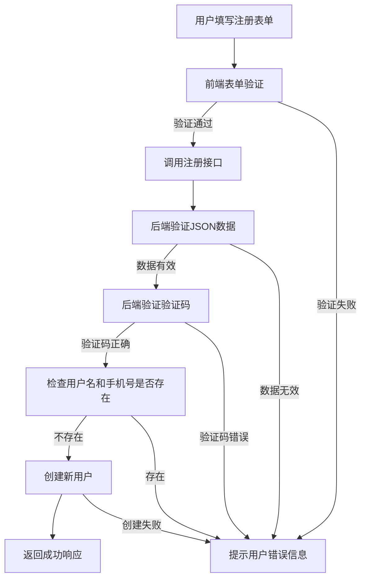
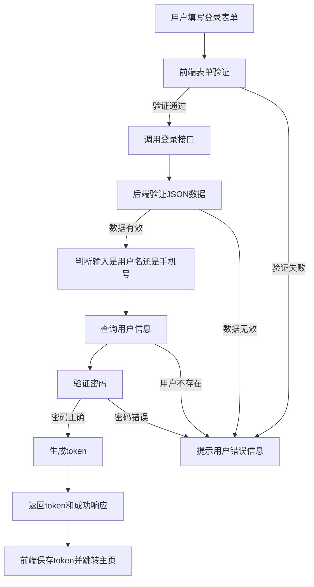
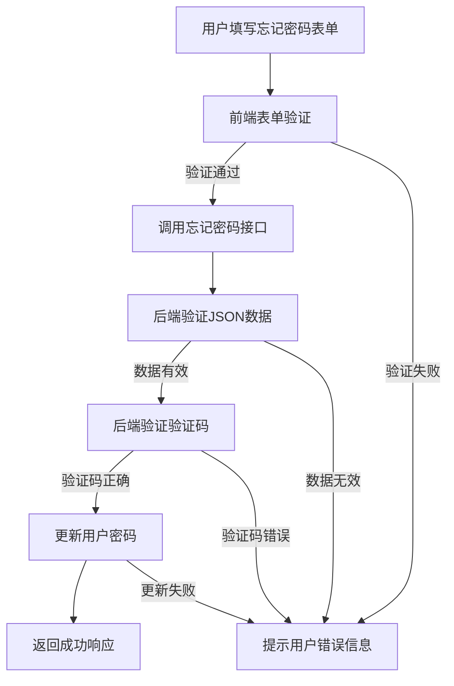

# 🚀 测试平台开发实录（一）：账号体系模块设计与实现

> 本系列将记录我在独立开发测试平台过程中的一些关键模块实现过程，涵盖功能拆解、接口设计、逻辑校验、异常处理及安全策略等。平台正处于早期开发阶段，我计划将典型实现经验沉淀为系列文章，便于后续复用与优化，也欢迎同行交流与建议。

---

## 🧭 模块背景

一个测试平台的用户体系是平台功能的基础，良好的账号体系不仅影响使用体验，还直接关系到平台的安全性和可扩展性。

因此，我在初期优先开发并打磨**注册、登录、忘记密码**这三个核心模块，为后续的用户权限、操作审计、数据隔离等功能做好基础支撑。

---

## 🛠️ 模块拆解与设计思路

账号体系主要包含以下三个基础能力：

### ✅ 1. 注册模块

**目的**：完成新用户创建，并保证数据唯一性和注册安全性。

**实现要点**：
- 用户名/手机号唯一校验
- 图形或短信验证码验证
- 注册密码强度要求（例如 ≥8 位、需包含数字+字母）
- 统一使用 POST 请求传参，避免信息暴露在 URL 中
- 注册成功后不自动登录，需显式登录获取 token

**示例请求参数**（POST `/register`）：
```json
{
  "username": "tester01",
  "phone": "13800000000",
  "password": "Test1234",
  "code": "583274"
}
```

**响应结果示例**：
```json
{
  "code": 200,
  "message": "注册成功"
}
```

**流程图**


**扩展建议**：
- 注册行为加入审计日志，记录注册时间/IP
- 支持第三方登录（如微信/QQ）
- 可以考虑引入邮箱验证机制，进一步增强安全性

---

### 🔐 2. 登录模块

**目的**：验证用户身份，并返回 JWT token 作为会话凭证。

**实现要点**：
- 支持用户名或手机号登录
- 密码使用加盐 hash 存储（如 bcrypt）
- 登录失败次数过多后暂时锁定账号（防止暴力破解）
- 返回标准化 token（建议使用 JWT，便于后续权限控制）
- token 有效期建议控制在 24 小时，可设计刷新机制

**示例请求参数**（POST `/login`）：
```json
{
  "username": "tester01",
  "password": "Test1234"
}
```

**响应结果示例**：
```json
{
  "code": 200,
  "token": "eyJhbGciOiJIUzI1NiIsInR5cCI6IkpXVCJ9..."
}
```

**流程图**


**扩展建议**：
- 登录行为纳入日志审计
- 添加设备识别和异地登录提醒功能

---

### 🔄 3. 忘记密码模块

**目的**：允许用户在忘记密码时，通过手机号验证码重设密码。

**实现要点**：
- 验证手机号存在并合法
- 验证短信验证码有效
- 密码重置后自动使旧 token 失效（防止被盗用）
- 密码强度与注册一致

**示例请求参数**（POST `/forgot_password`）：
```json
{
  "phone": "13800000000",
  "code": "839201",
  "new_password": "NewTest123"
}
```

**响应结果示例**：
```json
{
  "code": 200,
  "message": "密码重置成功"
}   
```

**流程图**


**扩展建议**：
- 加入密码历史检查，避免近期重复使用旧密码
- 可结合邮件/密保问题作为备选验证方式

---

## 🔒 安全策略补充

为确保账号体系安全，我同时设计并实现了以下机制：

- 所有密码均通过 bcrypt 加密存储，防止数据库泄露时被直接破解。
- 接口采用 token 鉴权，并对所有敏感接口启用身份验证中间件。
- 所有请求参数进行格式校验与字段白名单处理，防止注入攻击。
- 支持简单黑名单机制，用于屏蔽恶意请求 IP。

---

## ✅ 模块状态与计划

目前上述三个模块均已完成初版实现，并已接入平台前端，支持本地测试与基础功能验证。

后续计划包括：
- 引入基于角色的权限管理系统（RBAC），为不同用户分配不同的权限。
- 完善用户信息管理模块，支持修改个人信息、头像上传等功能。
- 优化登录流程，支持多因素认证（如邮箱验证码）。
- 增加用户状态管理，支持账号锁定、封禁等功能。

---

## 📎 项目模块相关文档参考

在开发测试平台的过程中，我也整理并发布了两篇与账号体系相关的技术文档，欢迎阅读：

- 📄 [登录与注册功能数据库设计与实现](https://linn0813.github.io/%E8%87%AA%E5%8A%A8%E5%8C%96%E6%B5%8B%E8%AF%95-%E5%B7%A5%E5%85%B7%E5%BC%80%E5%8F%91%EF%BC%88Test-Automation-Tool-Development%EF%BC%89/testplatform-login-and-registration/)：主要介绍了登录、注册模块的数据库表结构设计及后端实现细节。
- 📄 [用户模块数据库设计说明](https://linn0813.github.io/%E8%87%AA%E5%8A%A8%E5%8C%96%E6%B5%8B%E8%AF%95-%E5%B7%A5%E5%85%B7%E5%BC%80%E5%8F%91%EF%BC%88Test-Automation-Tool-Development%EF%BC%89/user-module-database/)：补充说明了用户信息表、验证码表的字段结构设计、数据约束逻辑以及设计思路。

这两篇内容与本篇文章相通，更加完整地展现了账号体系模块的设计与实现全过程，便于读者系统理解与参考复用。

---

## 📌 总结

在测试平台的搭建过程中，账号体系的搭建是基础但重要的一步。从用户体验、安全性、可维护性三个角度出发，我实现了注册、登录、忘记密码等功能，并在接口设计中兼顾了扩展性与安全性。

---
