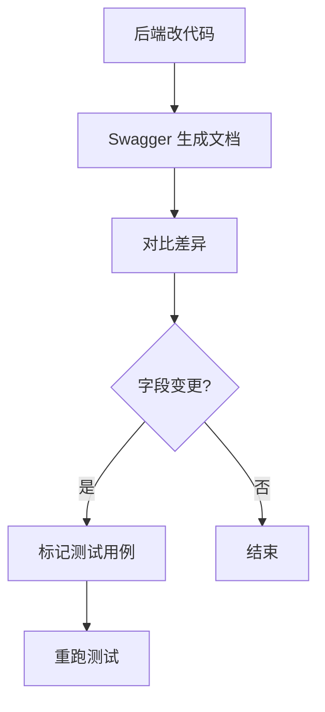

# 🛡️ 测试开发不再背锅：一份可落地的接口文档避坑指南 🚧

## 引言：从踩坑到真香的接口文档进化史

作为一名在测试平台项目里摸爬滚打的测试开发工程师，我曾在凌晨 3 点对着黑屏电脑怒吼：「这接口返回的字段怎么又变了？！」💢 前端同事甩来的 bug 截图上，null 值像幽灵一样出现在不该出现的地方，而后端同学坚持「文档里写得清清楚楚」——直到我翻出三个月前的文档，才发现字段变更记录被淹没在聊天记录里😅。

而我也在不断迭代测试平台的过程中意识到，**接口文档并不仅仅是给机器读的说明书，而是贯穿前端、后端、测试三方协作的重要资产**。当我们将其从「应付差事」变为「团队共建的协作资产」后，文档准确率和可维护性显著提升，联调时间缩短一半，bug 率下降 30%，甚至新人 onboarding 时也不再手忙脚乱。

这篇文章就是我结合实战总结的一套接口文档避坑指南，希望对你有所启发。

## 一、接口文档的核心目标与原则（测试开发版）

### 1. 核心目标：三大救命场景 💡
- **前端调用无歧义**：前端将 `createTime` 当字符串传，后端却要求时间戳，文档里一句 “格式：13 位时间戳” 就能避免踩坑。
- **维护可追溯**：`/api/case/run` 接口新增 `timeout` 参数，通过文档记录三个月后仍能快速定位变更点。
- **问题可定位**：前端报 400 错误时，文档写明 "错误码 400.101：用例 ID 缺失"，比 debug 快 10 倍。

### 2. 小型项目的「懒人原则」🚀
- **轻量级工具优先**：Swagger + Markdown + Postman 三件套足以覆盖大部分协作需求。
- **代码与文档联动**：用 Swagger 注解生成接口文档，改代码顺手改注解，效率翻倍。
- **聚焦高频模块**：优先写透核心模块如「用例管理」「接口执行」，边缘功能文档只需可用。

## 二、工具选择：测试开发的「效率三件套」

### 1. Swagger：自动文档神器 🌟
```java
@Api(tags = "测试用例模块")
@RestController
@RequestMapping("/api/case")
public class CaseController {
    @ApiOperation("执行测试用例")
    @PostMapping("/run")
    public Result<CaseResult> runCase(
        @ApiParam("用例 ID，必填") @RequestParam Long caseId,
        @ApiParam("超时时间") @RequestParam(required = false) Integer timeout
    ) {
        // ...
    }
}
```

### 2. Markdown：轻量好用的文档方式

#### POST /api/case/create
- 请求参数：
```json
{
  "caseName": "登录测试",
  "steps": [{"action": "输入账号", "expected": "成功"}]
}
```
- 响应：
```json
{
  "code": 200,
  "data": {"caseId": 1001},
  "msg": "用例创建成功"
}
```

### 3. Postman Collection：实战弹药库
保存请求参数和断言为 Collection，便于测试人员一键执行：
```javascript
pm.test("响应码应为 200", () => {
    pm.response.to.have.status(200);
});
```

### 4. AI 辅助：文档生成的加速引擎 🤖

在测试平台开发过程中，我们也逐渐引入了 AI 工具来辅助接口文档的生成与维护，提升效率的同时，也降低了人工出错率。具体应用方式如下：

- **自然语言生成接口注释**：在初步设计接口逻辑时，将接口功能、入参、出参等描述整理成自然语言 prompt，由 AI 自动生成 Swagger 注解或 Markdown 结构，大大减少重复体力劳动。
- **自动识别接口变化并生成变更摘要**：利用 Git hook + diff 脚本结合 AI 自动总结接口字段的增加/修改/删除，并生成 changelog，提示需要同步更新的测试用例及文档字段。
- **批量补全响应字段说明**：尤其在一些数据量大、响应结构嵌套深的接口中，使用 AI 工具自动分析 JSON 示例，补全字段含义、类型说明，大幅提升文档完整度。

例如，给出以下字段：

```json
{
  "userId": 1234,
  "status": "active",
  "lastLogin": "2024-12-01T10:00:00Z"
}
```

通过 AI 可快速生成如下 Markdown 表格说明：

| 字段名    | 类型     | 说明             |
|-----------|----------|------------------|
| userId    | int      | 用户唯一标识     |
| status    | string   | 当前账户状态     |
| lastLogin | datetime | 最近一次登录时间 |

⚠️ **建议**：AI 工具不能完全替代测试的判断，但非常适合承担重复、结构化任务，让测试开发把更多精力放在设计测试逻辑上。


## 三、文档内容结构：测试开发的「必看重点」

### 1. 全局说明
```json
{
  "400.101": "参数缺失",
  "401": "token 失效",
  "500.201": "数据库查询失败"
}
```

### 2. 接口详情结构
| 参数名 | 类型 | 必填 | 说明 | 测试点 |
|-------|------|------|------|--------|
| page  | int  | 是   | 页码，从 1 开始 | 0、负数 |
| size  | int  | 是   | 每页条数，最大 50 | 超最大值、0 |

### 3. 响应字段说明
```json
{
    "data": {
        "caseList": [
            {
                "caseId": 1001,
                "caseName": "登录测试",
                "createTime": 1687161600000, // 时间戳，单位毫秒
                "status": 1 // 1 - 待执行，2 - 执行中，3 - 已完成
            }
        ]
    }
}
```

## 四、文档维护流程

### 版本记录示例
**v1.1.0（2025-06-18）**
- `/api/case/import` 新增 `sheetName` 参数
- `/api/report/old-format` 废弃，改为 `/api/report/new-format`

### 自动化同步流程（Mermaid 示例）


## 五、实战案例片段

### 接口示例
- **URL**：/api/case/list
- **关注点**：
  - 状态过滤是否生效
  - 分页逻辑是否正确

### 响应模板
```json
{
  "code": 200,
  "data": {
    "total": 100,
    "pages": 5,
    "currentPage": 1,
    "list": [
      {
        "caseId": 1001,
        "caseName": "登录功能测试",
        "createTime": 1687161600000,
        "status": 3,
        "executeTime": 5200
      }
    ]
  }
}
```

## 六、总结：接口文档真香定律

1. 工具选得对，下班早归队：Swagger + Postman 组合提高测试开发效率。
2. 文档写得细，bug 远离你：文档越细致，测试越全面。
3. 维护做得勤，项目不出坑：变更及时同步，联调顺利交付。

> 一份清晰易读的接口文档，是团队协作的润滑剂，也是测试效率的加速器 🚀

