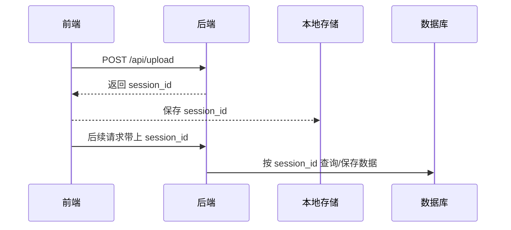

# 🎯前后端生成 `session_id` 的优劣对比与实战建议

在一些业务流程中，我们常需要为一段操作生成一个“会话标识符”，也就是 `session_id`。它就像一个“流程ID”，贯穿用户操作的始终，比如上传一个 CSV 文件后，进行多步处理并最终生成报告。

这个 `session_id` 应该由前端生成？还是后端生成？

这是一个看似简单、实则充满实践经验的问题。这篇文章将为你详解两种方案的优缺点、适用场景，以及我们在真实项目中的推荐做法。

---

## 🔍 场景回顾：session\_id 是什么？

`session_id` 在前后端分离项目中，通常不是传统意义上的“登录会话”，而是用来标识某个业务流程的数据，比如：

* 一次文件上传任务
* 一组数据处理的批次
* 一个用户临时操作过程

关键需求是：**前后端都能识别这个 session，并围绕它存取数据或状态**。

---

## 🧭 方案一：前端生成 session\_id

### ✨ 示例写法

```js
// 前端生成 UUID 作为 session_id
const sessionId = crypto.randomUUID() || generateCustomUUID();
localStorage.setItem('session_id', sessionId);

// 接口请求时带上
axios.post(`/api/xxx`, data, {
  headers: { 'X-Session-ID': sessionId }
});
```

### ✅ 优点

* 🔁 **控制权在前端**：适用于用户操作频繁切换、刷新等需要自己掌控 session 生命周期的场景；
* 🧩 **支持完整流程的 session 复用**：比如上传 CSV → 配置字段映射 → 分步处理 → 下载报告，全流程一个 session\_id；
* 🔐 **唯一性可控**：前端用 `uuid` 即可生成，基本避免重复。

### ⚠ 缺点

* 📦 **需要自行存储和管理**：需要用 `localStorage` / `sessionStorage` / `Pinia` 等保存；
* 🔄 **刷新/关闭浏览器可能丢失**：需要处理 session 失效的回退逻辑；
* 🧠 **对新手来说有一定复杂度**：需要考虑 session\_id 有效性、恢复逻辑等。

---

## 🧭 方案二：后端生成 session\_id

### ✨ 示例流程

1. 前端发起请求（如上传 CSV），不带 session\_id；
2. 后端生成 session\_id，处理业务并返回；
3. 前端将 session\_id 存储（如存在内存或 localStorage）；
4. 后续所有请求都携带该 session\_id。

```js
// 上传 CSV，后端返回 session_id
const res = await axios.post('/api/upload', file);
const sessionId = res.data.session_id;

// 之后请求都带上这个 ID
axios.post('/api/process', data, {
  headers: { 'X-Session-ID': sessionId }
});
```

### ✅ 优点

* 🔒 **安全性更高**：后端统一生成并维护，避免伪造；
* 🧘 **前端实现更轻松**：无需自己生成/维护 session，只需拿来用；
* 🔄 **适合一次性任务**：如每次上传、每次分析都独立处理；

### ⚠ 缺点

* 🤝 **需一次“握手”过程**：前端不能立即拥有 session\_id，得等后端返回；
* 🧵 **流程中断易丢失 session**：前端若不存储好，可能丢失当前上下文；
* ⏳ **状态依赖后端**：session 生命周期、清理策略完全依赖后端设计。

---

## 🎯 推荐实践：后端生成为主，前端生成为辅

### ✅ 推荐选型指南：

| 场景               | 推荐方式        | 理由            |
| ---------------- | ----------- | ------------- |
| 一次性操作（上传、查询）     | 后端生成        | 安全、解耦、稳定      |
| 多步流程需同一个 session | 后端生成（前端存用）  | 保持上下文一致       |
| 多标签页并行流程（互不干扰）   | 前端生成        | 避免 session 冲突 |
| 要求断点续传/流程恢复      | 前端生成 + 本地缓存 | 灵活持久管理        |

---

## 🛠 实战推荐方案：后端生成 + 前端存用

在大多数业务中，我们推荐如下组合策略：

1. 用户上传文件时，**后端生成 session\_id 并返回**；
2. 前端将 session\_id 存储（如放在 Pinia、localStorage 中）；
3. 后续每一步接口调用都带上这个 session\_id；
4. 后端根据 session\_id 管理中间状态、数据等；
5. 若用户刷新页面，可尝试恢复 session\_id 并重建上下文。

这种方案在实际项目中：

* 安全 ✅
* 稳定 ✅
* 可控 ✅
* 开发体验佳 ✅

---

## 🧪 示例：后端生成 session\_id 的完整流程



---

## 🧠 总结

| 方案               | 控制方 | 推荐使用场景              |
| ---------------- | --- | ------------------- |
| 前端生成 session\_id | 前端  | 多流程共享、流程恢复、多标签并行    |
| 后端生成 session\_id | 后端  | 安全、标准、易维护（绝大多数项目推荐） |

🔔 **最佳实践**：推荐使用 “**后端生成、前端存用**” 模式。既能统一流程，又能兼顾安全与可控。

---

> 你在项目中是如何处理 `session_id` 的？欢迎留言交流！


